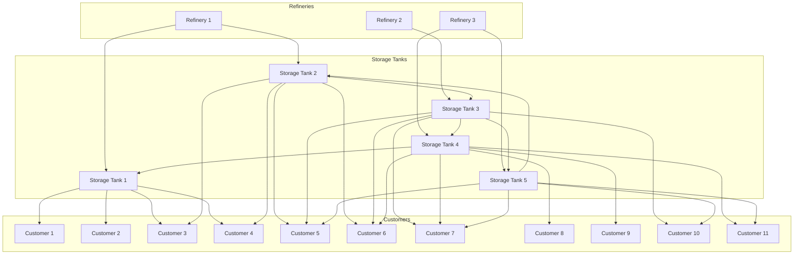

# Backend application for rating the challenge of SmartHacks 2024 hackaton

## The problem

### Task

Optimize the delivery of fuels from refineries to customers using a network of intermediate storage tanks, pipelines, and trucks. The challenge involves managing constraints, minimizing costs, and reducing CO2 emissions while ensuring timely deliveries to customers under contractually defined terms.

### Problem Description

Your team is tasked with developing an algorithm to manage the supply chain network efficiently.

The network consists of:

1. **Refineries** with limited storage capacities, daily outputs, costs & CO2 emissions for stopping and starting.

2. **Intermediate Storage Tanks** distributed across the network, with capacity limits, daily intake, and outtake capacities.

3. **Customers** with specific fuel demands and delivery time frames, maximum intake capacities, and specific penalty for delivering outside the requested time frames.

4. **Transportation Channels**: pipelines and trucks with their respective costs, lead times (refinery to tank, tank to tank, tank to customer), and CO2 emissions. Note that tank to customer can be only fulfilled by truck.


The customers post delivery requests. Each request consists of the following:

- **Requesting Customer** – the identifier of the customer requesting the delivery

- **Posting date** – the day when the request was posted

- **Quantity** – number of units requested

- **Delivery start day** – first day when the delivery is accepted

- **Delivery end day** – last day when the delivery is accepted without penalties

Note that delivery start day is always greater or equal to posting day + 3.



## The "game"

The game's objective is to optimize the Cost and CO2 KPIs.

### Authetication & Authorization

Authentication and authorization is handled through an API key. Each team will receive an API key when the challenge evaluation will begin. Keep it safe and do not share it.  

For local use, all teams have the same API Key ```7bcd6334-bc2e-4cbf-b9d4-61cb9e868869```.
The API Key is passed as header ```API-KEY```. All requests need API keys.

### Game sessions

Each team can have exactly one active session. Initializing the session with ```POST /api/v1/session/start``` will initalize the game from day 0 and with the provided network's initial state.
For testing and other special purposes, the sessions can also be ended on request with ```POST /api/v1/session/end```. No session ID is required. In "battle mode"", ending the session this way results in DSQ. The organizers might request a reset for technical reasons in exceptional cases.

### Network map and initial state

The backend doesn't provide the network map and initial state. 

For local running, the CSVs are available [here](/eval-platform/src/main/resources/liquibase/data).

For "battle mode", please download the CSV files from the provided URL, available 5 minutes before the "battle mode" begins. Make sure you're not using the provided development dataset.

## How rounds are handled

Games start at round (day) 0.

For each round, you can provide the list of movements to be executed on the current day. The API allows empty movements list (expected at day 0).

The API will return an error only if you don't provide the right ```SESSION-ID``` and ```API-KEY``` headers, or the current day.

The response will include:

- a list of posted request deliveries (demands) by the customers
- a list of penalties applied for the day
- cost and CO2 KPIs values calculated for the current day
- cost and CO2 KPIs values calculated for the whole session

The API doesn't reject data based on failing validation but it applies penalties in cost and CO2 terms.

### Steps done by the backend in each round

#### Step 1

Client provided movements are validated and saved. The provided movements will be subtracted later from the source nodes in the current day but will arrive after ```lead_time``` days to the destination. 

If movements are for connections that don't exist, then a penalty of type ```INVALID_CONNECTION``` will be issued for each movement. This is a very high value penalty (150 times amount for cost, 100 times amount for CO2). Additionally, if the amount is 0, the penalty will consider an amount of 100. If the amount is negative, the penalty amount would be the provided amount multiplied by -100.

If a movement amount is 0 or negative for a valid connection, then the movement is not registered and a penalty of type ``INVALID_MOVEMENT_AMOUNT`` is issued. The penalty value is calculated with the formula:  


$$penalty = amount * leadTime * distance * coefPerDistanceAndVolume $$
where
```math
amount=\begin{cases}
100, \text{when movement amount = 0} \\
- 100 * \text{movement amount}, \text{when amount} \lt 0
\end{cases}
```


#### Step 2

For each refinery, the internal stock is updated by the daily production rate. Also the production cost and CO2 emissions are calculated for all the refineries.

#### Step 3

In movements are prepared. An IN movement is a movement where the $$(postedDay + leadTime) = currentDay$$.
Out movements are prepared. An OUT movement is a movement where the $$postedDay = currentDay$$

For each refinery, the stock is decreased with the total amount of the out movements.

For each storage tank, the stock is decreased with the total amount of the out movements and increased by the total amount of the in movements.

Movements' cost is calculated as:
```math
movementsCosts = \sum{} (amount * distance * cost_{DistanceAndVolume})
```

Movements' CO2 is calculated as 
```math
movementsCO_2 = \sum{} (amount * distance * co2_{DistanceAndVolume})
```

#### Step 4

For each source node (refineries and storage types) calculate the daily output amounts.

If the output exceeds the node's maximum output rate, the generate a penalty of type ```REFINERY_OVER_OUTPUT``` or ```STORAGE_TYPE_OVER_OUTPUT``` calculated as $$(amount - max_{output}) * c_{overOutput}$$

#### Step 5

For each destination node (customers and storage types) calculate the daily input amounts.

If the input exceeds the node's maximum output rate, the generate a penalty of type ``CUSTOMER_OVER_INPUT`` or ``STORAGE_TYPE_OVER_INPUT`` calculated as $$(amount - max_{input}) * c_{overInput}$$


#### Step 6

For the out movements that target customers, use the total amount delivered to match with the customer's demands.

If there aren't any pending deliveries or an amout was left after matching deliveries for the customer, then it is an unexpected delivery with penalty type ```CUSTOMER_UNEXPECTED_DELIVERY```, calculated as
```math
amount_{unexpected} * ( c_{earlyDelivery} + c_{lateDelivery} ) * 100
```


Requested demands with remaining amounts greater than 0 are ordered by start delivery day. Demands are matched in this order, fulfilling as much of them out of the IN movements total amount.

If the matched demand is delivered before start delivery day, then a penalty of type ```CUSTOMER_EARLY_DELIVERY``` is issues, with with the value of

```math
amount_{delivered} * (day_{startDelivery} - day_{current}) * c_{earlyDelivery} 
```

If the matched demand is delivered after end delivery day, then a penalty of type ```CUSTOMER_LATE_DELIVERY``` is issues, with with the value of 

```math
amount_{delivered} * (day_{current} - day_{endDelivery}) * c_{lateDelivery} 
```

#### Step 7

For each node, calculate capacity overflows and underflows penalties.

Note that the penalties will be generated daily as long as they are not fixed. If there are no movements out of a storage tank and the capacity is exceeded, each day a penalty will be generated.

Overflow = when the stock in a node (refinery and storage tank) exceeds the node's capacity. The daily penalty is calculated as 

```math
(stock - max_{capacity} )* c_{overflow} 
```

Penalty types are ``` STORAGE_TANK_OVERFLOW ``` or ``` REFINERY_OVERFLOW ```.

Undeflow = when the stock in a node (refinery and storage tank) is under 0. The daily penalty is calculated as 

```math
(0 - stock) * c_{undeflow} 
```

Penalty types are ```STORAGE_TANK_UNDERFLOW``` and ```REFINERY_TANK_UNDERFLOW```.

#### Step 8

Identifies connections with on transit movements. If the amount in transit is greater than the max capacity of the connection, then a penalty of type ```CONNECTION_OVER_CAPACITY``` is issues, with a value of 
```math
\sum{}^\text{movements on connection} (amount - max_{capacity}[connection] ) * c_{overCapacity} 
```

A movement is in transit if the current day is between movement's posted day and posted day + lead times days. It includes the both ends of the interval.

#### Step 9

Updates the cost and co2 values on the session, with the sum of production costs, movement costs and penalties.

Increase the current day by one.

Triggers session end if the configured number of rounds is reached.

### Session end

Session end happens automatically after the 42nd round (configurable).

At the end of the session, the following additional penalties are calculated:

- One penalty of type ```PENDING_MOVEMENTS``` will be generated for all pending movements at the end of the game. It is calculated as  
```math
 cost = \sum{}(amount * \frac{(day_{posted} + leadTime) * distance}{lead time} * cost_{distanceAndVolume}) 
 ```
 
 ```math
 co_2 = \sum{}(amount * \frac{(day_{posted} + leadTime) * distance}{lead time} * co2_{distanceAndVolume}) 
 ```
 
- One penalty of type ```UNMET_DEMANDS``` will be generated for all unmet demands. It is calculated as 
```math
c_{multiplier} * \sum{}(amount_{remaining} * referenceDays * c_{lateDelivery}) * 10 
```

```math
referenceDays = \begin{cases}
	numberOfDays - day_{startDelivery} \text{, when the delivery was not fulfilled at all} \\
	numberOfDays - day_{endDelivery} \text{, when the delivery was partially fulfilled}
\end{cases}
```

When the session is manually ended, then the end of session penalties are multiplied by a factor of 
```math 
c_{multiplier} = 700 * \frac{numberOfDays}{day_{current}} 
```

When the session is automatically finished, the multiplier is
```math
c_{multiplier} = 50
```

## The evaluation application

Same code is here is available both for local running (development environment) and for the evaluation game.

> The provided code must not be changed, just configured and run as it is

### Architecture & technology

The application is built as a Spring Boot Rest Backend, on top of a relational database.

```mermaid
graph TD
	 A1[Hackathon App]
	 
    subgraph Rest Controllers
        B1[PlayController]
        
    end

    subgraph JPA Repository
        C3[DemandRepository]
        C4[DemandStatusRepository]
        C1[ConnectionRepository]
        C5[MovementRepository]
        C6[PenaltiesRepository]
        C7[RefineryRepository]
        C8[SessionRepository]
        C9[StorageTankRepository]
        C10[TeamRepository]
    end

    E1[Database Tables]  

	 A1 --> B1
    B1 --> D1[SessionService]
    B1 --> D2[NetworkService]
    B1 --> D3[DemandService]
    B1 --> D4[TeamService]
    D2 --> C1
    D2 --> C5
    D2 --> C7
    D2 --> C9
    D1 --> C6
    D1 --> C10
    D1 --> C8
    D3 --> C4
    D3 --> C3
    D4 --> C10
    
    C1 --> E1
    C3 --> E1
    C4 --> E1
    C5 --> E1 
    C6 --> E1 
    C7 --> E1 
    C8 --> E1 
    C9 --> E1 
    C10 --> E1 
 ```

### Prerequisites

To run the application locally, you need the following:

- a Java JDK, at least version 17
- Maven


### Local configuration

Locally, the application uses an in-memory database named H2. It is automatically launched with the application and populated with data. If no additional configuration is provided, all the data will be lost when the application is closed. If you want to have your data persisted, then the following configuration must be done.

1. Create a file named ```application-local.properties``` in the folder ```eval-platform/src/main/resources```. Note that there should already be a ```application.properties``` file in that folder. Leave that unchanged.

2. Add the following configuration into the newly created file:
```properties
spring.datasource.url=jdbc:h2:file:<path>/<db-name> 
```
- Replace ``<path>`` with a folder on your machine. Note that both on Windows, Linux and MacOS, forward slashes are to be used. 
> Examples: ```C:/work/smarthacks2024```, ```/home/morpheus/smarthacks2024```
- Replace ``<db-name>`` with a db name (files will start with that name).
> Examples: ``db``, ``eval_db``  

### Running the application locally

The command to run the application locally is 
```sh
	mvn spring-boot:run -Dspring-boot.run.profiles=local
```
It can only work from the root of the project (``/eval-platform``). Make sure that java is configured correctly (JAVA_HOME and paths are set correctly to point to a Java 17+ JDK).


### Accessing the application locally

By default, the application is listening to port ``8080``, so its base URL is [http://localhost:8080](http://localhost:8080).

The exposed APIs are available at the full path ``http://locahohst:8080/api/v1/``.

> Because there is no GET endpoint exposed and all the endpoints require an ``API-KEY`` header, you will get an error page when you try to access any URL using a browser. Try using a Rest client, such as [Bruno](https://www.usebruno.com/). You can find some Bruno examples in this repository.

If port 8080 is not available for you, then you can change it by adding the following line in either ``application.properties`` or ``application-local.properties``:

```properties
server.port=<your port>
```
### API Specifications

The exposed APIs are documented as OpenAPI stardard specifications. Once the application is started, the specifications are available as following:

- JSON formatted OpenAPI specification: [http://locahost:8080/api-docs](http://localhost:8080/api-docs)
- YAML formatted OpenAPI specifications (downloadable): [http://localhost:8080/api-docs.yaml](http://localhost:8080/api-docs.yaml)
- Swagger UI: [http://localhost:8080/swagger-ui.html](http://localhost:8080/swagger-ui.html)
